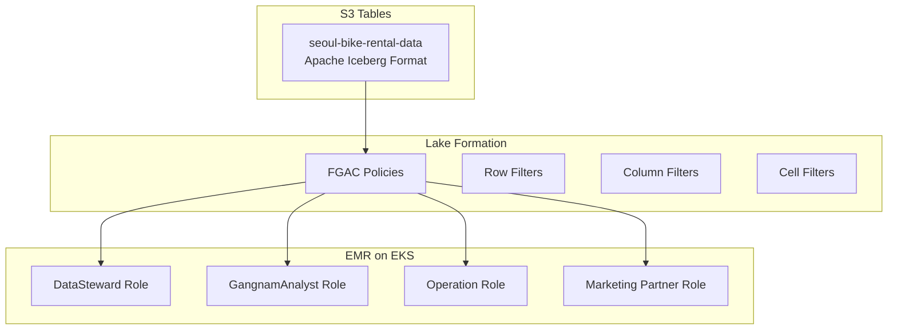

# Lake Formation FGAC with S3 Tables and EMR on EKS
## 서울시 자전거 대여 데이터를 활용한 세밀한 데이터 접근 제어 구현

[](https://aws.amazon.com/lake-formation/)
[](https://docs.aws.amazon.com/AmazonS3/latest/userguide/s3-tables.html)
[](https://docs.aws.amazon.com/emr/latest/EMR-on-EKS-DevelopmentGuide/)

이 프로젝트는 AWS Lake Formation의 Fine-Grained Access Control(FGAC)을 S3 Tables와 EMR on EKS 환경에서 구현하는 완전한 데모입니다. 서울시 자전거 대여 데이터를 활용하여 4가지 역할별로 차별화된 데이터 접근 제어를 보여줍니다.

## 🏗️ 아키텍처 개요



## 📊 시나리오 설명

### 데이터 구조
- **테이블**: `seoul-bike-rental-data-202506.bike_rental_data`
- **형식**: Apache Iceberg (S3 Tables)
- **컬럼**: 12개 (rental_id, station_id, district, payment_amount, user_id 등)
- **데이터 범위**: 서울시 25개 구, 2025년 6월 자전거 대여 데이터 (150,000건)

### 🎭 역할별 접근 권한

| 역할 | 접근 구역 | 연령대 | 접근 컬럼 | 개인정보 | 결제정보 | 목적 |
|------|-----------|--------|-----------|----------|----------|------|
| **LF_DataStewardRole** | 전체 25개구 | 전체 | 전체 12개 | ✅ | ✅ | 데이터 품질 관리 |
| **LF_GangnamAnalyticsRole** | 강남구만 | 전체 | 11개 (user_id 제외) | ❌ | ✅ | 강남구 분석 |
| **LF_OperationRole** | 전체 25개구 | 전체 | 8개 (운영 관련만) | ❌ | ❌ | 운영 최적화 |
| **LF_MarketingPartnerRole** | 강남구만 | 20대만 | 9개 (마케팅 관련) | ❌ | ❌ | 타겟 마케팅 |

## 🚀 빠른 시작

### 사전 준비사항

```bash
# AWS CLI 설정
aws configure set region ap-northeast-2

# 필요한 도구 설치
pip install boto3 pandas matplotlib seaborn

# 프로젝트 클론
git clone https://github.com/your-repo/lake-formation-fgac-demo.git
cd lake-formation-fgac-demo
```

### 1단계: 샘플 데이터 S3 업로드

```bash
# S3 버킷 생성 및 샘플 데이터 업로드
./scripts/01-setup-sample-data.sh
```

### 2단계: Lake Formation 권한 설정

```bash
# Lake Formation FGAC 권한 설정
./scripts/02-setup-lakeformation-permissions.sh
```

### 3단계: EMR on EKS 클러스터 설정

```bash
# EMR on EKS 환경 구성
./scripts/03-setup-emr-on-eks.sh
```

### 4단계: 분석 Job 실행

```bash
# 역할별 EMR on EKS Job 실행
./scripts/04-run-emr-jobs.sh
```

### 5단계: 결과 확인

```bash
# 권한 검증 및 결과 분석
./scripts/05-verify-and-analyze.sh
```

## 📁 프로젝트 구조

```
lake-formation-fgac-demo/
├── README.md                          # 프로젝트 가이드
├── scripts/                           # 실행 스크립트
│   ├── 01-setup-sample-data.sh       # 샘플 데이터 설정
│   ├── 02-setup-lakeformation-permissions.sh  # Lake Formation 권한 설정
│   ├── 03-setup-emr-on-eks.sh        # EMR on EKS 설정
│   ├── 04-run-emr-jobs.sh            # Job 실행
│   └── 05-verify-and-analyze.sh      # 검증 및 분석
├── spark-jobs/                       # Spark 분석 코드
│   ├── data-steward-analysis.py      # 데이터 관리자 분석
│   ├── gangnam-analytics.py          # 강남구 분석가 분석
│   ├── operation-analysis.py         # 운영팀 분석
│   └── marketing-partner-analysis.py # 마케팅 파트너 분석
├── sample-data/                      # 샘플 데이터
│   ├── seoul-bike-rental-sample.csv  # 서울 자전거 대여 샘플 데이터
│   └── data-dictionary.md            # 데이터 사전
├── docs/                            # 문서
│   ├── architecture.md              # 아키텍처 설명
│   ├── setup-guide.md              # 상세 설정 가이드
│   └── troubleshooting.md          # 문제 해결 가이드
└── results/                        # 분석 결과 (실행 후 생성)
    ├── visualizations/             # 시각화 결과
    └── reports/                   # 분석 리포트
```

## 🎯 예상 결과

### Data Steward Role
- 총 대여 건수: **150,000건**
- 접근 가능 구역: **25개 구**
- 고유 사용자 수: **25,000명**
- 총 수익: **₩45,000,000**

### Gangnam Analytics Role
- 총 대여 건수: **8,500건** (강남구만)
- 접근 가능 구역: **1개 구** (강남구)
- 고유 사용자 수: **N/A** (접근 차단)
- 총 수익: **₩2,550,000**

### Operation Role
- 총 대여 건수: **150,000건**
- 접근 가능 구역: **25개 구**
- 고유 사용자 수: **N/A** (접근 차단)
- 총 수익: **N/A** (접근 차단)

### Marketing Partner Role (NEW!)
- 총 대여 건수: **1,200건** (강남구 20대만)
- 접근 가능 구역: **1개 구** (강남구)
- 접근 가능 연령대: **20대만**
- 마케팅 타겟 분석: **가능**

## 🔑 핵심 학습 포인트

### 1. Multi-dimensional FGAC
- **Row-level**: 지역별 필터링 (강남구)
- **Column-level**: 역할별 컬럼 접근 제어
- **Cell-level**: 연령대별 세밀한 필터링 (20대)

### 2. 실제 비즈니스 시나리오
- 데이터 관리자의 전체 데이터 거버넌스
- 지역별 분석가의 제한된 분석
- 운영팀의 운영 데이터 접근
- 마케팅 파트너의 타겟 고객 분석

### 3. 확장 가능한 아키텍처
- EMR on EKS의 Kubernetes 기반 확장성
- S3 Tables의 Apache Iceberg 최적화
- Lake Formation의 중앙집중식 권한 관리

## 🛠️ 기술 스택

- **AWS Lake Formation**: Fine-Grained Access Control
- **Amazon S3 Tables**: Apache Iceberg 기반 테이블 스토리지
- **Amazon EMR on EKS**: Kubernetes 기반 Spark 분석
- **Apache Spark**: 대규모 데이터 처리
- **Python**: 데이터 분석 및 시각화

## 📚 추가 리소스

- [AWS Lake Formation 개발자 가이드](https://docs.aws.amazon.com/lake-formation/)
- [EMR on EKS 사용자 가이드](https://docs.aws.amazon.com/emr/latest/EMR-on-EKS-DevelopmentGuide/)
- [S3 Tables 문서](https://docs.aws.amazon.com/AmazonS3/latest/userguide/s3-tables.html)
- [Apache Iceberg 문서](https://iceberg.apache.org/)

## 🤝 기여

버그 리포트나 기능 제안은 GitHub Issues를 통해 제출해 주세요.

## 📄 라이선스

이 프로젝트는 MIT 라이선스 하에 제공됩니다.

---

**⚠️ 주의사항**: 이 데모는 교육 목적으로 제작되었습니다. 프로덕션 환경에서 사용하기 전에 보안 검토를 수행하세요.
