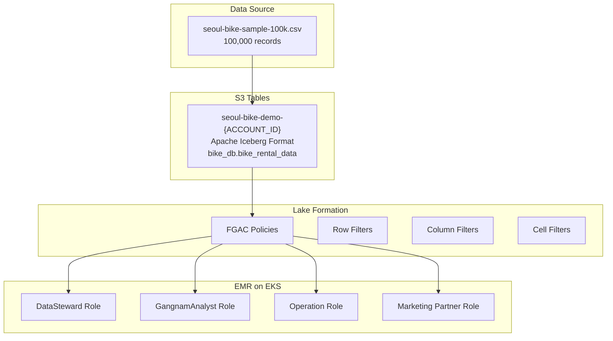

# Lake Formation FGAC with S3 Tables and EMR on EKS
## 서울시 따릉이 자전거 대여 데이터를 활용한 세밀한 데이터 접근 제어 구현

[](https://aws.amazon.com/lake-formation/)
[](https://docs.aws.amazon.com/AmazonS3/latest/userguide/s3-tables.html)
[](https://docs.aws.amazon.com/emr/latest/EMR-on-EKS-DevelopmentGuide/)

이 프로젝트는 AWS Lake Formation의 Fine-Grained Access Control(FGAC)을 S3 Tables와 EMR on EKS 환경에서 구현하는 완전한 데모입니다. **실제 서울시 따릉이 자전거 대여 데이터 100,000건**을 활용하여 4가지 역할별로 차별화된 데이터 접근 제어를 보여줍니다.

## 🏗️ 아키텍처 개요



## 📊 실제 데이터 현황

### 데이터 구조
- **S3 Tables 버킷**: `seoul-bike-demo-{ACCOUNT_ID}-{TIMESTAMP}` (자동 생성)
- **테이블**: `bike_db.bike_rental_data`
- **형식**: Apache Iceberg (S3 Tables)
- **컬럼**: 11개 (rental_id, station_id, station_name, usage_min, distance_meter, birth_year, gender 등)
- **데이터 범위**: 서울시 전체 구, 2024년 12월 자전거 대여 데이터 (**100,000건**)

### 📈 실제 데이터 분포

#### 구별 분포 (상위 10개)
- **강서구**: 13,238건 (13.2%)
- **영등포구**: 8,882건 (8.9%)
- **송파구**: 8,240건 (8.2%)
- **양천구**: 6,577건 (6.6%)
- **노원구**: 6,342건 (6.3%)
- **마포구**: 4,307건 (4.3%)
- **광진구**: 4,155건 (4.2%)
- **강동구**: 4,069건 (4.1%)
- **구로구**: 4,403건 (4.4%)
- **성동구**: 3,568건 (3.6%)

#### 성별 분포
- **남성(M)**: 63,630건 (63.6%)
- **여성(F)**: 32,435건 (32.4%)
- **결측치**: 3,902건 (3.9%)

#### 대여 시간 통계
- **평균 대여 시간**: 16.9분
- **최소 대여 시간**: 0분
- **최대 대여 시간**: 849분 (14시간 9분)
- **중앙값**: 9.0분

#### 이동 거리 통계
- **평균 이동 거리**: 1,795.2m (약 1.8km)
- **최소 이동 거리**: 0m
- **최대 이동 거리**: 49,750m (약 49.8km)
- **중앙값**: 1,199.0m (약 1.2km)

## 🔐 Lake Formation FGAC 상세 설명

### Multi-dimensional Access Control

이 프로젝트는 **3차원 데이터 접근 제어**를 구현합니다:

#### 1. **Row-level Security (행 수준 보안)**
```sql
-- 강남구 데이터만 접근
WHERE district = '강남구'

-- 강남구 + 20-30대만 접근  
WHERE district = '강남구' AND (birth_year >= 1994 AND birth_year <= 2004)
```

#### 2. **Column-level Security (컬럼 수준 보안)**
```sql
-- 역할별 접근 가능한 컬럼
DataSteward: 전체 11개 컬럼
GangnamAnalyst: 10개 컬럼 (birth_year 제외)
Operation: 9개 컬럼 (birth_year, gender 제외)
MarketingPartner: 10개 컬럼 (birth_year 제외)
```

#### 3. **Cell-level Security (셀 수준 보안)**
- 특정 조건을 만족하는 셀만 접근 가능
- 연령대별 세밀한 필터링 (20-30대)
- 지역별 + 연령대별 복합 조건

### 실제 비즈니스 시나리오

| 역할 | 접근 구역 | 연령대 | 접근 컬럼 | 개인정보 | 목적 | 예상 결과 |
|------|-----------|--------|-----------|----------|------|-----------| 
| **LF_DataStewardRole** | 전체 구 | 전체 | 전체 11개 | ✅ | 데이터 품질 관리 | 100,000건 |
| **LF_GangnamAnalyticsRole** | 강남구만 | 전체 | 10개 (birth_year 제외) | ❌ | 강남구 분석 | ~3,000건 |
| **LF_OperationRole** | 전체 구 | 전체 | 9개 (운영 관련만) | ❌ | 운영 최적화 | 100,000건 |
| **LF_MarketingPartnerRole** | 강남구만 | 20-30대만 | 10개 (마케팅 관련) | ❌ | 타겟 마케팅 | ~2,000건 |

## 🚀 단계별 실행 가이드

### 사전 준비사항

```bash
# 1. 프로젝트 클론
git clone https://github.com/DannyKang/S3-Tables-LakeFormation-with-EMRonEKS
cd lake-formation-fgac-demo

# 2. AWS CLI 설정 (ap-northeast-2 리전 사용)
aws configure set region ap-northeast-2

# 3. 필요한 Python 패키지 설치
pip install boto3 pandas matplotlib seaborn
```

⚠️ **중요**: 
- 모든 스크립트는 프로젝트 루트 디렉토리에서 실행해야 합니다
- 스크립트는 **순서대로** 실행해야 합니다 (01 → 02 → 03 → 04 → 05 → 06 → 07 → 08)
- 각 단계 완료 후 다음 단계로 진행하세요

---

## 📋 단계별 실행 순서

### 1단계: S3 Tables 버킷 및 테이블 생성

```bash
# S3 Tables 버킷 생성 (고유한 버킷명 자동 생성)
./scripts/01-create-s3-table-bucket.sh
```

**자동 생성되는 리소스**:
- **S3 Tables 버킷**: `seoul-bike-demo-{ACCOUNT_ID}-{TIMESTAMP}`
- **네임스페이스**: `bike_db`
- **테이블**: `bike_rental_data`
- **환경 설정 파일**: `.env` (다른 스크립트들이 자동으로 사용)

⚠️ **중요**: `.env` 파일을 삭제하지 마세요. 모든 스크립트가 이 파일의 설정을 사용합니다.

### 2단계: 데이터 적재

```bash
# 로컬 데이터를 S3 Tables에 적재
./scripts/02-load-data-to-s3-tables.sh
```

**데이터 적재 과정**:
1. **로컬 데이터 검증**: `./sample-data/seoul-bike-sample-100k.csv` (100,000건)
2. **S3 업로드**: 임시 S3 버킷에 CSV 파일 업로드
3. **Athena 쿼리**: CREATE TABLE AS SELECT로 S3 Tables에 적재
4. **검증**: 적재된 데이터 건수 확인

**예상 소요 시간**: 5-10분

### 3단계: IAM 역할 생성

```bash
# Lake Formation FGAC용 IAM 역할 생성
./scripts/03-create-iam-roles.sh
```

**생성되는 역할들**:
- **LF_DataStewardRole**: 데이터 관리자 - 전체 데이터 접근
- **LF_GangnamAnalyticsRole**: 강남구 분석가 - 강남구 데이터만
- **LF_OperationRole**: 운영팀 - 운영 데이터만  
- **LF_MarketingPartnerRole**: 마케팅 파트너 - 강남구 20-30대만

### 4단계: Lake Formation 기본 권한 설정

```bash
# Lake Formation 기본 권한 설정
./scripts/04-setup-lakeformation-permissions-native.sh
```

**설정되는 기본 권한**:
- **Database 권한**: bike_db 데이터베이스 접근 권한
- **Table 권한**: bike_rental_data 테이블 기본 권한
- **Location 권한**: S3 Tables 버킷 접근 권한

### 5단계: EMR on EKS 클러스터 설정

```bash
# EMR on EKS 환경 구성 (Blueprint 기반)
./scripts/05-setup-emr-on-eks.sh
```

**설정되는 리소스**:
- **EKS 클러스터**: seoul-bike-emr (Karpenter 기반 자동 스케일링)
- **네임스페이스**: emr-data-team
- **Virtual Cluster**: seoul-bike-emr-vc
- **서비스 계정**: 4개 (역할별 IRSA 연결)
- **Spark 코드 버킷**: seoul-bike-analytics-scripts-{ACCOUNT_ID}

**예상 소요 시간**: 15-20분

### 6단계: Lake Formation FGAC 설정

```bash
# Lake Formation FGAC 권한 설정
./scripts/06-setup-lake-formation-fgac.sh
```

**설정되는 권한**:
- **Data Cells Filter**: 역할별 행/컬럼 필터 생성
- **LF Permissions**: 필터 기반 권한 부여
- **Security Configuration**: EMR on EKS Lake Formation 통합 설정

**핵심 FGAC 기능**:
- **Row-level 필터링**: 지역별 (강남구)
- **Column-level 필터링**: 역할별 컬럼 접근 제어  
- **Cell-level 필터링**: 연령대별 세밀한 제어 (20-30대)

### 7단계: 분석 Job 실행

```bash
# 역할별 EMR on EKS Job 실행
./scripts/07-run-emr-jobs.sh
```

**실행되는 분석 Job**:
- **data-steward-analysis**: 전체 데이터 품질 관리 및 거버넌스 분석
- **gangnam-analytics-analysis**: 강남구 지역 특화 분석 및 서비스 기획
- **operation-analysis**: 시스템 운영 최적화 및 정거장 관리 분석
- **marketing-partner-analysis**: 강남구 20-30대 타겟 마케팅 분석

**Job 모니터링**:
```bash
# Job 상태 확인
aws emr-containers list-job-runs --virtual-cluster-id {VIRTUAL_CLUSTER_ID} --region ap-northeast-2

# 특정 Job 상세 정보
aws emr-containers describe-job-run --virtual-cluster-id {VIRTUAL_CLUSTER_ID} --id {JOB_ID} --region ap-northeast-2
```

### 8단계: 결과 검증 및 분석

```bash
# 권한 검증 및 결과 분석
./scripts/08-verify-and-analyze.sh
```

**검증 내용**:
- **FGAC 권한 검증**: 각 역할별 접근 가능한 데이터 확인
- **결과 분석**: Job 실행 결과 및 성능 분석
- **리포트 생성**: 역할별 분석 결과 요약

## 📁 프로젝트 구조

```
lake-formation-fgac-demo/
├── README.md                                    # 프로젝트 가이드
├── data-dictionary.md                           # 데이터 사전
├── scripts/                                     # 실행 스크립트 (8단계)
│   ├── 01-create-s3-table-bucket.sh            # S3 Tables 버킷 생성
│   ├── 02-load-data-to-s3-tables.sh            # 데이터 적재
│   ├── 03-create-iam-roles.sh                  # IAM 역할 생성
│   ├── 04-setup-lakeformation-permissions-native.sh # Lake Formation 기본 권한
│   ├── 05-setup-emr-on-eks.sh                  # EMR on EKS 설정
│   ├── 06-setup-lake-formation-fgac.sh         # Lake Formation FGAC 설정
│   ├── 07-run-emr-jobs.sh                      # Job 실행
│   └── 08-verify-and-analyze.sh                # 검증 및 분석
├── spark-jobs/                                 # Spark 분석 코드 (4개 역할)
│   ├── data-steward-analysis.py                # 데이터 관리자 분석
│   ├── gangnam-analytics-analysis.py           # 강남구 분석가 분석
│   ├── operation-analysis.py                   # 운영팀 분석
│   └── marketing-partner-analysis.py           # 마케팅 파트너 분석
├── sample-data/                                # 샘플 데이터
│   ├── seoul-bike-sample-100k.csv              # 100,000건 샘플 데이터
│   ├── seoul-bike-sample-preview.csv           # 미리보기용 50건
│   └── data-dictionary.md                      # 데이터 사전
├── job-templates/                              # EMR Job 템플릿 (실행 시 생성)
├── pod-templates/                              # Pod 템플릿 (실행 시 생성)
├── docs/                                       # 문서
└── results/                                    # 분석 결과 (실행 후 생성)
```

## 🔧 다중 사용자 환경 지원

이 데모는 **여러 사용자가 동시에 따라할 수 있도록** 설계되었습니다:

### 🎯 고유 리소스 생성
- **S3 Tables 버킷**: `seoul-bike-demo-{ACCOUNT_ID}-{TIMESTAMP}` 형식으로 자동 생성
- **IAM 역할**: 계정별로 독립적으로 생성
- **EKS 클러스터**: 사용자별 고유한 클러스터명 사용

### 📁 환경 설정 관리
- **`.env` 파일**: 첫 번째 스크립트 실행 시 자동 생성
- **자동 설정 공유**: 모든 스크립트가 `.env` 파일의 설정을 자동으로 사용
- **충돌 방지**: 다른 사용자와 리소스명 충돌 없음

## 🎯 예상 결과

### Data Steward Role
- 총 대여 건수: **100,000건**
- 접근 가능 구역: **전체 구**
- 평균 대여 시간: **16.9분**
- 평균 이동 거리: **1,795.2m**

### Gangnam Analytics Role
- 총 대여 건수: **~3,000건** (강남구만)
- 접근 가능 구역: **1개 구** (강남구)
- 개인정보 접근: **차단** (birth_year 제외)
- 분석 범위: **강남구 지역 특화 분석**

### Operation Role
- 총 대여 건수: **100,000건**
- 접근 가능 구역: **전체 구**
- 개인정보 접근: **차단** (birth_year, gender 제외)
- 분석 범위: **운영 효율성 및 정거장 이용률**

### Marketing Partner Role
- 총 대여 건수: **~2,000건** (강남구 20-30대만)
- 접근 가능 구역: **1개 구** (강남구)
- 접근 가능 연령대: **20-30대만**
- 분석 범위: **타겟 마케팅 분석**

## 🔑 핵심 학습 포인트

### 1. Multi-dimensional FGAC
- **Row-level**: 지역별 필터링 (강남구)
- **Column-level**: 역할별 컬럼 접근 제어
- **Cell-level**: 연령대별 세밀한 필터링 (20-30대)

### 2. 실제 비즈니스 시나리오
- 데이터 관리자의 전체 데이터 거버넌스
- 지역별 분석가의 제한된 분석
- 운영팀의 운영 데이터 접근
- 마케팅 파트너의 타겟 고객 분석

### 3. 확장 가능한 아키텍처
- EMR on EKS의 Kubernetes 기반 확장성
- S3 Tables의 Apache Iceberg 최적화
- Lake Formation의 중앙집중식 권한 관리

### 4. 실제 데이터 활용
- **100,000건**의 실제 서울시 자전거 대여 데이터
- 다양한 구별 분포 (강서구 13.2% ~ 기타 구)
- 현실적인 대여 시간 분포 (평균 16.9분)
- 실제 이동 거리 패턴 (평균 1.8km)

## 🛠️ 기술 스택

- **AWS Lake Formation**: Fine-Grained Access Control
- **Amazon S3 Tables**: Apache Iceberg 기반 테이블 스토리지
- **Amazon EMR on EKS**: Kubernetes 기반 Spark 분석
- **Apache Spark**: 대규모 데이터 처리
- **Python**: 데이터 분석 및 시각화
- **Karpenter**: EKS 노드 자동 스케일링

## 🔍 문제 해결

### 일반적인 문제들

#### 1. `.env` 파일 관련
```bash
# .env 파일이 없는 경우
./scripts/01-create-s3-table-bucket.sh

# .env 파일 내용 확인
cat .env
```

#### 2. AWS 권한 관련
```bash
# 현재 사용자 확인
aws sts get-caller-identity

# 필요한 권한: S3Tables, Lake Formation, EMR, EKS, IAM
```

#### 3. Job 실행 상태 확인
```bash
# Virtual Cluster ID 확인
source .env
echo $LF_VIRTUAL_CLUSTER_ID

# Job 목록 확인
aws emr-containers list-job-runs --virtual-cluster-id $LF_VIRTUAL_CLUSTER_ID
```

## 📚 추가 리소스

- [AWS Lake Formation 개발자 가이드](https://docs.aws.amazon.com/lake-formation/)
- [EMR on EKS 사용자 가이드](https://docs.aws.amazon.com/emr/latest/EMR-on-EKS-DevelopmentGuide/)
- [S3 Tables 문서](https://docs.aws.amazon.com/AmazonS3/latest/userguide/s3-tables.html)
- [Apache Iceberg 문서](https://iceberg.apache.org/)
- [Data on EKS Blueprint](https://awslabs.github.io/data-on-eks/)

## 🤝 기여

버그 리포트나 기능 제안은 GitHub Issues를 통해 제출해 주세요.

## 📄 라이선스

이 프로젝트는 MIT 라이선스 하에 제공됩니다.

---

**⚠️ 주의사항**: 이 데모는 교육 목적으로 제작되었습니다. 프로덕션 환경에서 사용하기 전에 보안 검토를 수행하세요.

**📊 데이터 출처**: 이 프로젝트에서 사용된 데이터는 실제 서울시 따릉이 자전거 대여 데이터를 기반으로 하되, 개인정보 보호를 위해 익명화 및 가공 처리되었습니다.
