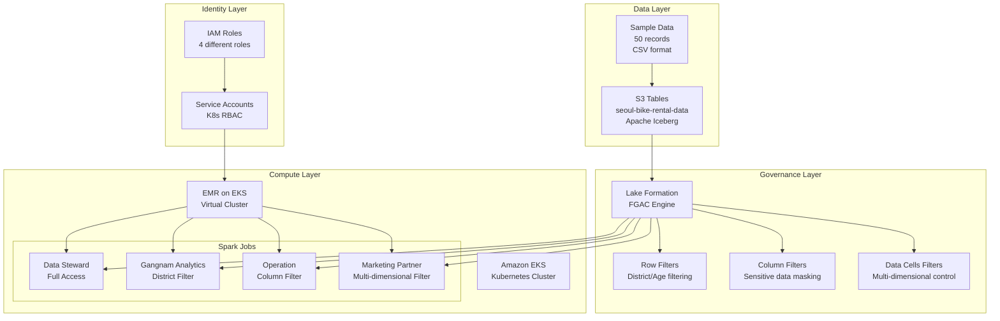

# Lake Formation FGAC 아키텍처 가이드

## 전체 아키텍처 개요



## 컴포넌트별 상세 설명

### 1. 데이터 레이어 (Data Layer)

#### S3 Tables
- **형식**: Apache Iceberg
- **위치**: seoul-bike-rental-data-202506 테이블 버킷
- **구조**: 
  - 네임스페이스: bike_db
  - 테이블: bike_rental_data
  - 컬럼: 12개 (rental_id ~ user_id)

#### 샘플 데이터
- **크기**: 50개 레코드
- **기간**: 2025년 6월 1일-4일
- **지역**: 강남구 중심 (60%), 기타 구 (40%)
- **연령대**: 20대 중심 (50%), 기타 연령대 (50%)

### 2. 거버넌스 레이어 (Governance Layer)

#### Lake Formation FGAC
- **역할**: 중앙집중식 데이터 접근 제어
- **기능**: 
  - 실시간 권한 검증
  - 쿼리 레벨 필터링
  - 감사 로그 생성

#### 필터 유형

##### Row Filters
```sql
-- Gangnam Analytics Role
district = '강남구'

-- Marketing Partner Role  
district = '강남구' AND age_group = '20대'
```

##### Column Filters
```yaml
Data Steward: [모든 컬럼]
Gangnam Analytics: [user_id 제외 11개 컬럼]
Operation: [payment_amount, user_id, age_group, gender 제외 8개 컬럼]
Marketing Partner: [payment_amount, user_id, rental_duration 제외 9개 컬럼]
```

### 3. 컴퓨트 레이어 (Compute Layer)

#### Amazon EKS
- **역할**: Kubernetes 기반 컨테이너 오케스트레이션
- **구성**:
  - 클러스터: seoul-bike-analytics-cluster
  - 네임스페이스: emr-on-eks-seoul-bike
  - 노드 그룹: m5.large 인스턴스

#### EMR on EKS
- **역할**: 서버리스 Spark 실행 환경
- **구성**:
  - Virtual Cluster: seoul-bike-analytics-vc
  - Spark 버전: 3.5.4 (EMR 7.2.0)
  - 실행 모드: Kubernetes 네이티브

#### Spark Jobs
각 역할별로 독립적인 Spark 애플리케이션 실행:

1. **Data Steward Analysis**
   - 전체 데이터 품질 검증
   - 구별/연령대별 통계 분석
   - 수익성 분석

2. **Gangnam Analytics**
   - 강남구 이용 패턴 분석
   - 정거장별 선호도 분석
   - 시간대별 이용 분석

3. **Operation Analysis**
   - 정거장 이용률 분석
   - 자전거 배치 최적화
   - 정비 우선순위 분석

4. **Marketing Partner Analysis**
   - 강남구 20대 타겟 분석
   - 마케팅 캠페인 추천
   - 고객 세그멘테이션

### 4. 아이덴티티 레이어 (Identity Layer)

#### IAM 역할
```yaml
LF_DataStewardRole:
  - Lake Formation 전체 권한
  - S3 Tables 읽기/쓰기
  - Glue 카탈로그 접근

LF_GangnamAnalyticsRole:
  - Lake Formation 제한된 권한
  - 강남구 데이터만 접근
  - 개인정보 접근 불가

LF_OperationRole:
  - Lake Formation 운영 권한
  - 운영 관련 컬럼만 접근
  - 결제/개인정보 접근 불가

LF_MarketingPartnerRole:
  - Lake Formation 마케팅 권한
  - 강남구 20대 데이터만 접근
  - 마케팅 관련 컬럼만 접근
```

#### Kubernetes 서비스 계정
- **역할**: IAM 역할과 Kubernetes Pod 연결
- **구성**: IRSA (IAM Roles for Service Accounts)
- **보안**: 최소 권한 원칙 적용

## 데이터 플로우

### 1. 데이터 수집 플로우
```
CSV 샘플 데이터 → S3 임시 버킷 → Spark ETL → S3 Tables (Iceberg)
```

### 2. 권한 검증 플로우
```
Spark 쿼리 → Lake Formation → 권한 검증 → 필터 적용 → 결과 반환
```

### 3. 분석 실행 플로우
```
EMR Job 시작 → K8s Pod 생성 → IAM 역할 가정 → Spark 실행 → 결과 저장
```

## 보안 모델

### 1. 다층 보안 (Defense in Depth)
- **네트워크**: VPC, 보안 그룹
- **인증**: IAM, IRSA
- **인가**: Lake Formation FGAC
- **데이터**: 암호화 (전송/저장)

### 2. 최소 권한 원칙 (Principle of Least Privilege)
- 각 역할은 업무 수행에 필요한 최소한의 데이터만 접근
- 컬럼 레벨, 행 레벨 세밀한 제어
- 시간 기반 접근 제어 (필요시 확장 가능)

### 3. 감사 및 모니터링
- CloudTrail을 통한 API 호출 로깅
- Lake Formation 접근 로그
- EMR Job 실행 로그

## 확장성 고려사항

### 1. 데이터 볼륨 확장
- S3 Tables의 자동 압축 및 최적화
- Iceberg의 파티셔닝 전략
- EMR on EKS의 자동 스케일링

### 2. 사용자 확장
- 추가 역할 정의 및 권한 설정
- 동적 권한 할당
- 셀프 서비스 분석 환경

### 3. 지역 확장
- 다중 리전 데이터 복제
- 크로스 리전 Lake Formation 권한
- 지역별 컴플라이언스 요구사항

## 성능 최적화

### 1. 쿼리 최적화
- Iceberg의 메타데이터 기반 필터링
- 파티션 프루닝
- 컬럼 프로젝션

### 2. 리소스 최적화
- EMR on EKS의 동적 리소스 할당
- Spot 인스턴스 활용
- 캐싱 전략

### 3. 비용 최적화
- S3 Intelligent Tiering
- EMR on EKS의 서버리스 모델
- 사용량 기반 과금

## 모니터링 및 알림

### 1. 메트릭
- 쿼리 성능 메트릭
- 데이터 접근 패턴
- 리소스 사용률

### 2. 알림
- 권한 위반 시도
- 비정상적인 데이터 접근
- 시스템 오류

### 3. 대시보드
- 실시간 모니터링 대시보드
- 비용 분석 대시보드
- 보안 감사 대시보드
